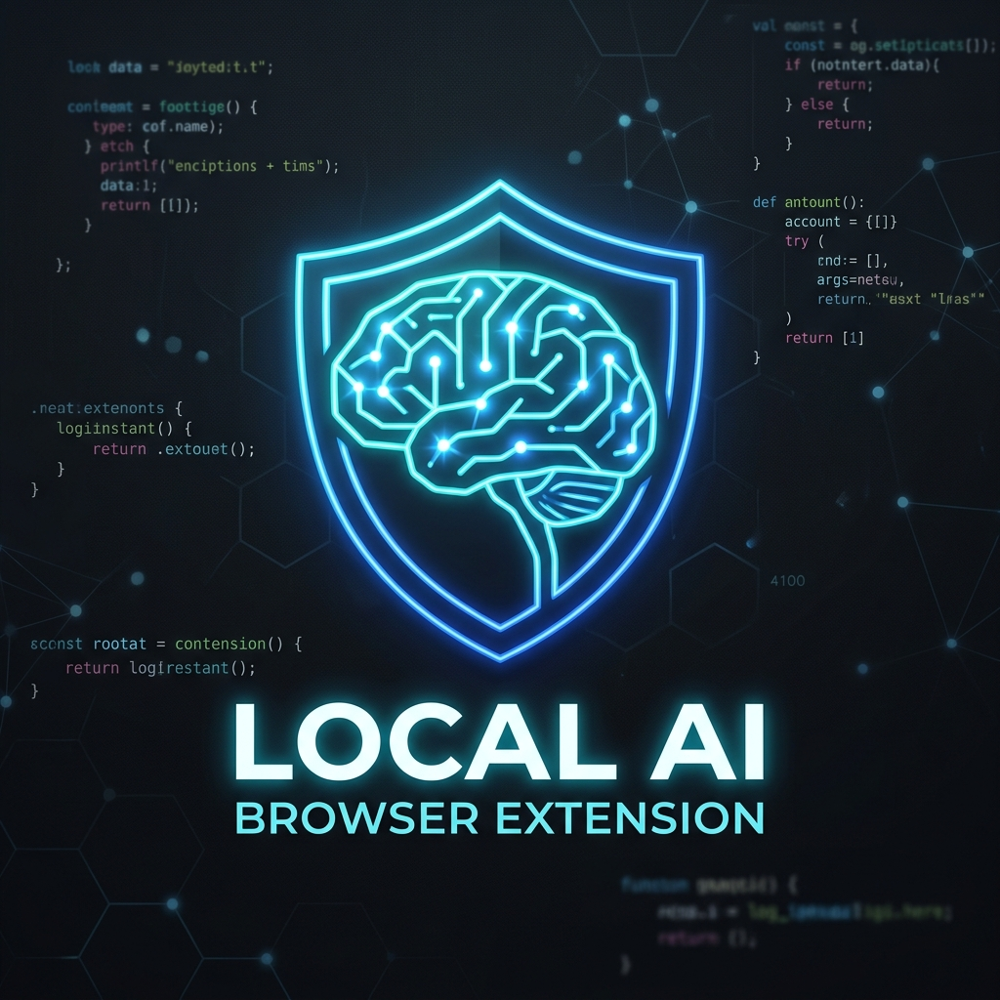

<div align="center">
  

  # Neural Architecture Local Helper (AI Browser Extension)

  **A completely private, local-first AI browser extension powered by Ollama.**

  [](https://github.com/rudransh)
  []()
  []()
  []()
</div>

---

## 🚀 Overview

**Neural Architecture Local Helper** is a next-generation browser extension designed to bring the power of AI directly into your browser context **without sending a single byte of data to the cloud**. Everything runs entirely on your local machine using [Ollama](https://ollama.com/), providing ultimate privacy and security.

This is a **Manifest V3** side-panel extension. It can read your current active tab, summarize content, answer questions based on the page context, extract forms, and securely store your profile information in a local encrypted vault to autofill web forms automatically.

## ✨ Features (V2.0)

### 💬 Local AI Chat & Page Awareness
- **Context-Aware:** The AI reads the visible text and links on your active tab, letting you chat directly about the webpage.
- **Privacy First:** All requests are sent to your local Ollama server (`localhost:11434`). No API keys, no cloud servers.
- **Slash Commands:** Quickly execute tasks with `/summary` (summarize page), `/takeSS` (capture screenshot), `/save` (save page locally), `/start` (new session), and `/clear`.
- **Model Switching:** Instantly switch between any of your locally installed Ollama models (e.g., `gemma4:26b`, `gemma4:e4b`) with automatic context-window optimization to prevent memory crashes.

### 💾 Session & History Management
- **Persistent Chat:** Close your browser and come back; your chat session is automatically saved to local storage and restored when you open the side panel.
- **History View:** A dedicated UI tab to view past conversations, organized by webpage and timestamp.
- **Page Snapshots:** Save a "frozen" snapshot of a webpage locally to revisit the context later.

### 🛡️ The Local Encrypted Vault
- **AES-GCM Encryption:** Secure your personal data using the Web Crypto API. Your data is encrypted locally with a master password using PBKDF2 key derivation.
- **Profile & Login Management:** Store multiple identities (Name, Email, Phone, Address) and credentials (URL, Username, Password) inside the extension.
- **Zero-Knowledge Architecture:** Your data never leaves your device. If you forget your master password, the vault is unrecoverable by design.

### 🪄 AI-Powered Structured Autofill
- **Form Extraction Engine:** The extension automatically scans complex webpages and extracts forms, identifying hidden labels and input fields.
- **Smart Matching:** It intelligently cross-references the extracted fields with your decrypted Vault Profiles and Logins.
- **User-Confirmed Filling:** It shows exactly where every piece of data is going (e.g., "Matches: Profile Email"). Nothing is filled until you explicitly click the "Autofill" button.

---

## 📁 Project Structure

```text
AI-browser/
├── src/
│   ├── content/              # Content scripts injected into webpages
│   │   └── index.ts          # Page text/link extraction, form discovery, DOM manipulation
│   ├── sidepanel/            # React UI running in the browser Side Panel
│   │   ├── SidePanel.tsx     # Main chat interface and tab routing
│   │   ├── HistoryView.tsx   # UI for past sessions
│   │   ├── VaultView.tsx     # UI for encrypted credentials
│   │   └── FormFillView.tsx  # UI for matching extracted forms with vault data
│   ├── lib/                  # Core services
│   │   ├── ollama.ts         # Communication with local Ollama daemon
│   │   ├── page.ts           # Message passing logic between Side Panel and Content Script
│   │   ├── history.ts        # Local storage wrappers for Chat and Snapshots
│   │   └── vault.ts          # Web Crypto API encryption engine (AES-GCM/PBKDF2)
│   ├── store/
│   │   └── index.ts          # Global state management using Zustand
│   └── config/
│       └── models.ts         # System prompts and context-window safety bounds
├── docs plan/                # Architecture roadmap and session notes
├── public/                   # Static assets (icons)
├── manifest.config.ts        # CRXJS Manifest V3 definition
├── vite.config.ts            # Vite bundler configuration
└── package.json              # Dependencies (React, Zustand, Lucide-React)
```

---

## ⚙️ Prerequisites

1. **Node.js** 18+ and npm.
2. **Ollama** installed and running locally.

   ```sh
   curl -fsSL https://ollama.com/install.sh | sh
   ollama pull gemma4:26b
   ollama pull gemma4:e4b
   ```

3. **Let the extension call Ollama.** Ollama refuses cross-origin requests by default. Start it with extension origins allowed:

   ```sh
   OLLAMA_ORIGINS="chrome-extension://*" ollama serve
   ```

   *(Or, to also keep dev-server access during development:)*
   ```sh
   OLLAMA_ORIGINS="chrome-extension://*,http://localhost:5173" ollama serve
   ```

## 🚀 Build & Installation

1. Install dependencies and build:
   ```sh
   npm install
   npm run build
   ```

2. Load the extension in Brave/Chrome:
   - Open `brave://extensions` (or `chrome://extensions`).
   - Enable **Developer mode** (top-right toggle).
   - Click **Load unpacked** and select the newly created `dist/` folder.

3. Pin the extension to your toolbar and open the Side Panel!

---

<div align="center">
  <i>Developed by <b>Rudransh</b> as a demonstration of localized, privacy-preserving AI architecture.</i>
</div>
